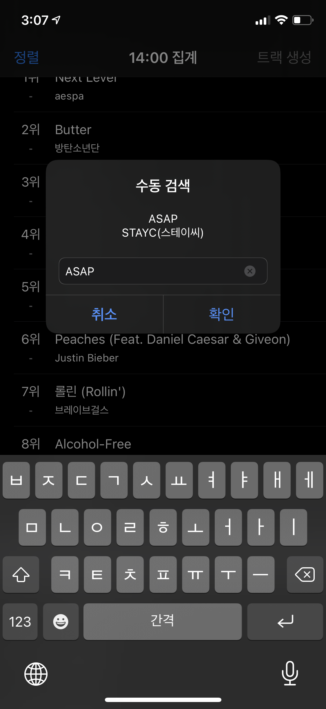
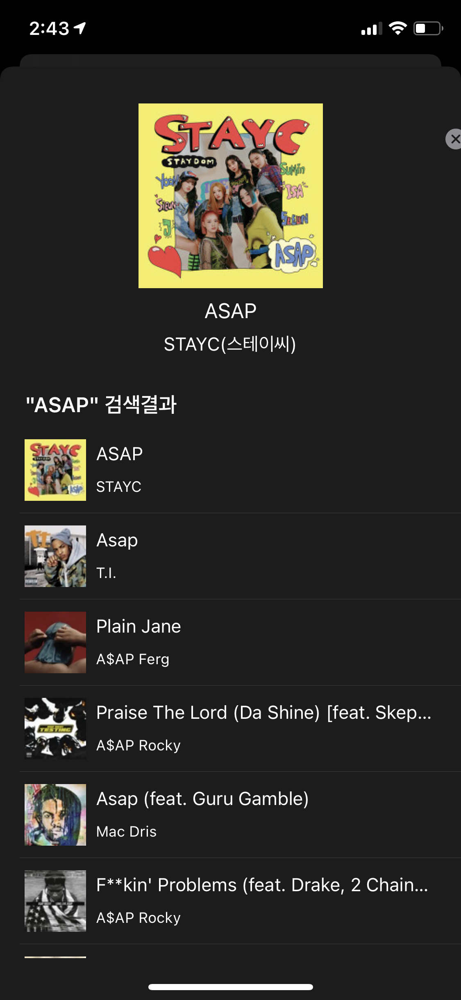

# KR100ToAppleMusic
국내 음원 사이트 Top100 음원 기반 AppleMusic 플레이리스트 생성 프로젝트

## 활용 기술
- Swift
- MVC Pattern
- Apple Music API
- Alamofire
- SwiftSoup
- Firebase
- SwiftJWT

## 기능
- [실시간 음원 순위 제공](#실시간-음원-순위-제공)
- [음원 탐색](#음원-탐색)
- [탐색 완료 후 정렬](#탐색-완료-후-정렬)
- [수동 검색 기능](#수동-검색-기능)
- [플레이리스트 생성](#플레이리스트-생성)

### 실시간 음원 순위 제공

### 음원 탐색  

### 탐색 완료 후 정렬  

### 수동 검색 기능  

### 플레이리스트 생성  

